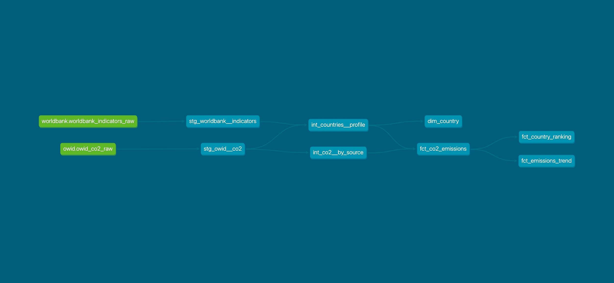

# Emissions Analytics


A modern data engineering pipeline for global CO2 emissions analysis, built with Apache Airflow, dbt, and BigQuery on Google Cloud Platform.

## Architecture

```
OWID CO2 Dataset (CSV)          World Bank API
        │                               │
        ▼                               ▼
  Python Ingestion              Python Ingestion
  (owid_to_bq.py)            (worldbank_to_bq.py)
        │                       incremental load
        │                               │
        ▼                               ▼
BigQuery — raw.owid_co2_raw    raw.worldbank_indicators_raw
        │                               │
        └───────────┬───────────────────┘
                    ▼
             dbt staging
      stg_owid__co2 (view)
      stg_worldbank__indicators (view)
                    │
                    ▼
          dbt intermediate
      int_countries__profile (view)   ← joins both sources
      int_co2__by_source (view)
                    │
                    ▼
              dbt marts
      fct_co2_emissions (table)
      fct_emissions_trend (table)
      fct_country_ranking (table)
      dim_country (table)
```

## Business Questions Answered

- Which countries are the highest CO2 emitters and how has that changed since 1990?
- What is the year-over-year emissions trend per country?
- How dependent is each country on fossil fuels?
- Which countries have the highest emissions per capita?
- What is the gap between production-based and consumption-based emissions per country?
- Which countries have the highest renewable energy share?
- How does electricity access correlate with emissions levels?
- How does urbanization relate to energy consumption per capita?

## Stack

| Layer | Tool |
|---|---|
| Orchestration | Apache Airflow 2.8 |
| Transformation | dbt 1.11 |
| Warehouse | Google BigQuery |
| Ingestion | Python + Pandas |
| Dependency management | uv |
| Infrastructure | Docker Compose |
| CI | GitHub Actions |

## Data Sources

| Source | Dataset | Granularity | Load strategy |
|---|---|---|---|
| [Our World in Data](https://github.com/owid/co2-data) | CO2 & energy by country | Country / year | Full refresh |
| [World Bank API](https://data.worldbank.org) | Energy & development indicators | Country / year | Incremental |

## Project Structure

```
emissions-analytics/
├── dags/
│   └── emissions_analytics_pipeline.py   # Airflow DAG
├── dbt/
│   ├── models/
│   │   ├── staging/                      # 1-to-1 with sources, light cleaning
│   │   ├── intermediate/                 # business logic, joins
│   │   └── marts/                        # analyst-ready tables
│   ├── macros/
│   ├── profiles.yml
│   └── dbt_project.yml
├── ingestion/
│   ├── owid_to_bq.py                     # OWID full refresh ingestion
│   └── worldbank_to_bq.py                # World Bank incremental ingestion
├── .github/
│   └── workflows/
│       └── dbt_ci.yml                    # CI pipeline
├── Dockerfile
├── docker-compose.yml
└── pyproject.toml
```

## dbt Lineage



## DAG

The pipeline runs daily at 6am. Both ingestions run in parallel before dbt starts:

```
ingest_owid_to_bq ──┐
                    ├──► dbt_deps ──► dbt_run_staging ──► dbt_test_staging
ingest_worldbank ───┘                      ──► dbt_run_intermediate ──► dbt_test_intermediate
                                                   ──► dbt_run_marts ──► dbt_test_marts
                                                               ──► dbt_generate_docs
```

## Getting Started

### Prerequisites

- Docker Desktop
- Google Cloud project with BigQuery enabled
- GCP service account with BigQuery Admin role

### Setup

1. Clone the repo:
```bash
git clone https://github.com/fkt1301/emissions-analytics.git
cd emissions-analytics
```

2. Copy the example env file and fill in your values:
```bash
cp .env.example .env
```

3. Place your GCP service account key at `keys/gcp-keyfile.json`

4. Create BigQuery datasets:
```bash
bq mk --dataset --location=EU YOUR_PROJECT_ID:raw
bq mk --dataset --location=EU YOUR_PROJECT_ID:staging
bq mk --dataset --location=EU YOUR_PROJECT_ID:intermediate
bq mk --dataset --location=EU YOUR_PROJECT_ID:marts
```

5. Start the stack:
```bash
docker compose up --build -d
```

6. Open Airflow at `http://localhost:8080` (admin/admin), trigger the DAG manually.

### Local dbt development

```bash
uv sync
cd dbt
../venv/bin/dbt deps --profiles-dir .
../venv/bin/dbt run --profiles-dir .
../venv/bin/dbt test --profiles-dir .
```
